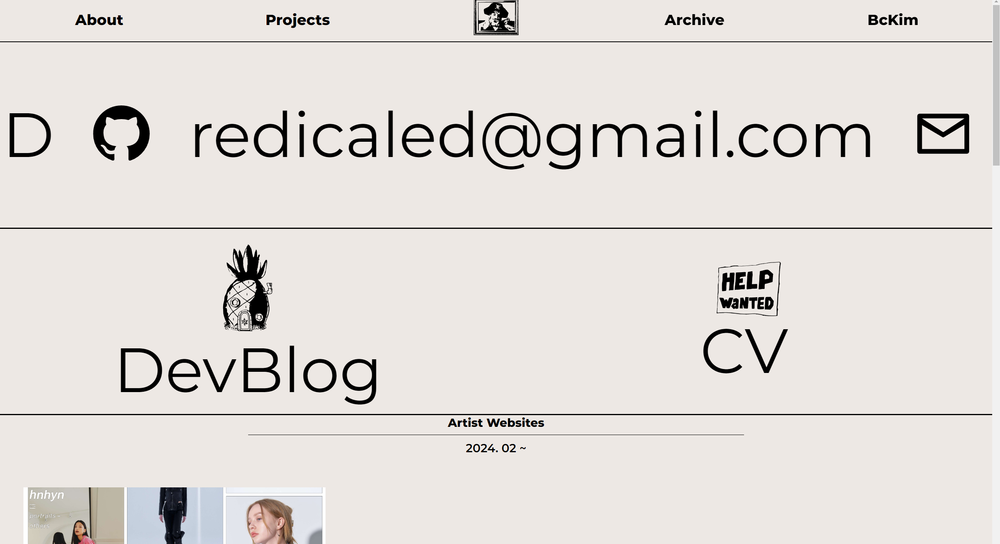
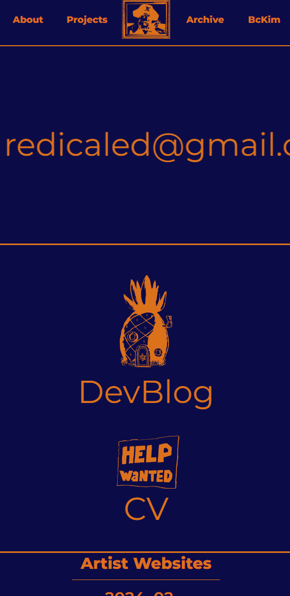
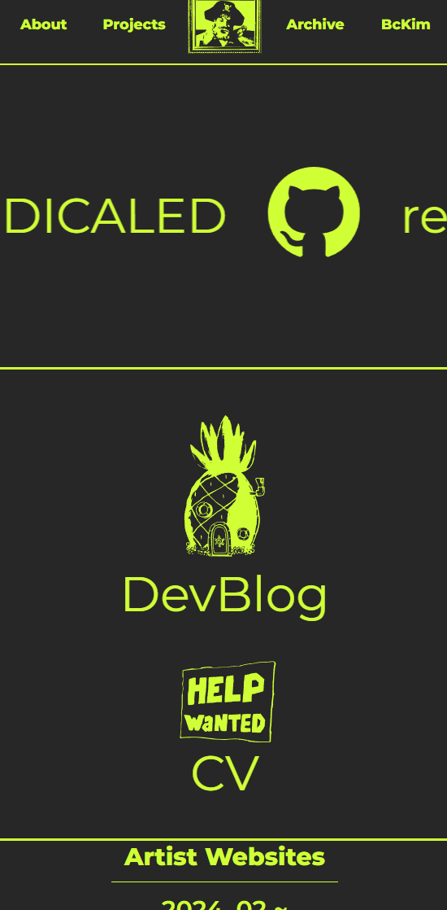
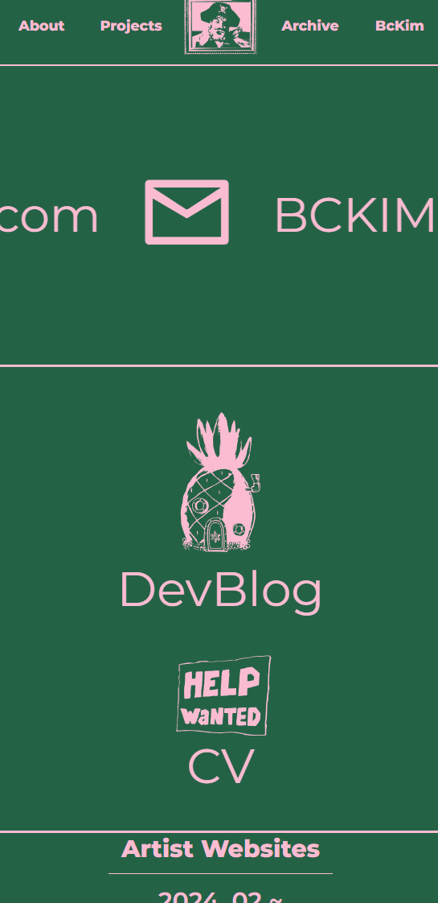
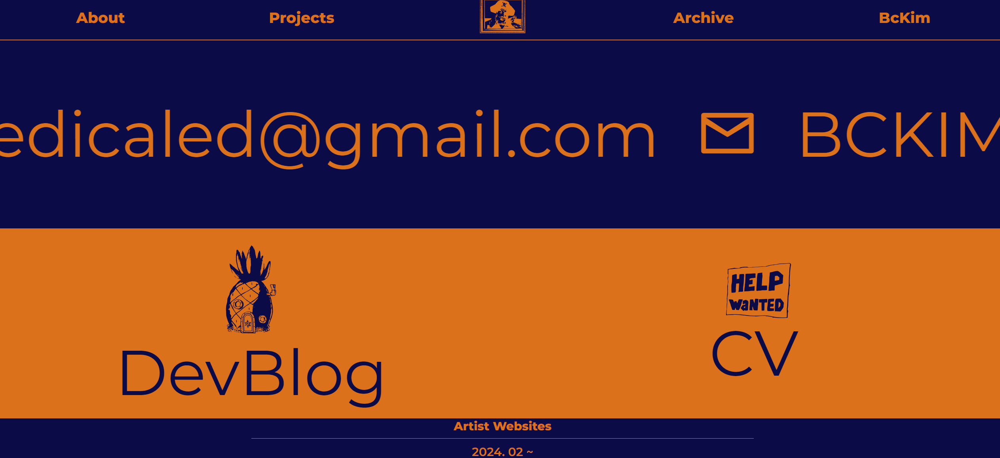

# https://www.redicaled.com

개인 포트폴리오 사이트

## 기술 스택
* React + Vite + Vercel
* Tailwind CSS

## 설명
개인 포트폴리오 사이트 제작 프로젝트

UX/UI를 중점적으로, 사이트 자체만으로 자신을 표현해보고 싶었습니다.

svg 파일 포맷을 이용하여 다양한 색감을 사용

  
  
  

간단한 반응형 디자인과 Framer motion을 이용한 디자인 구현

